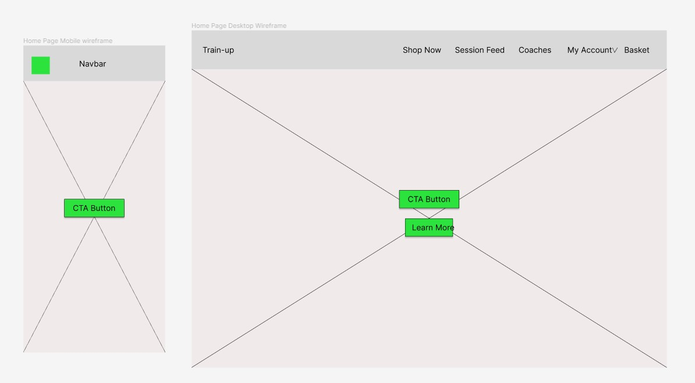
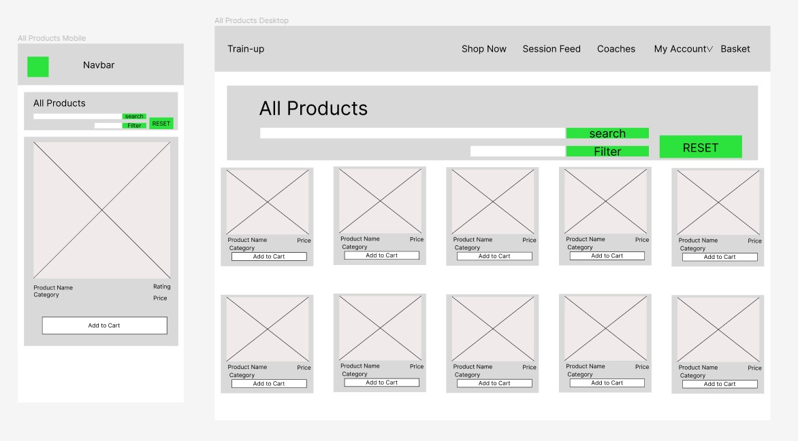
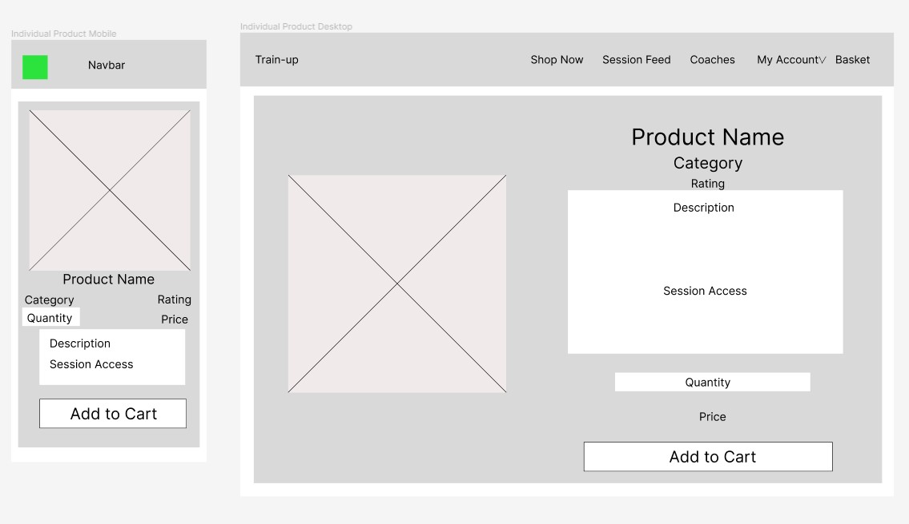
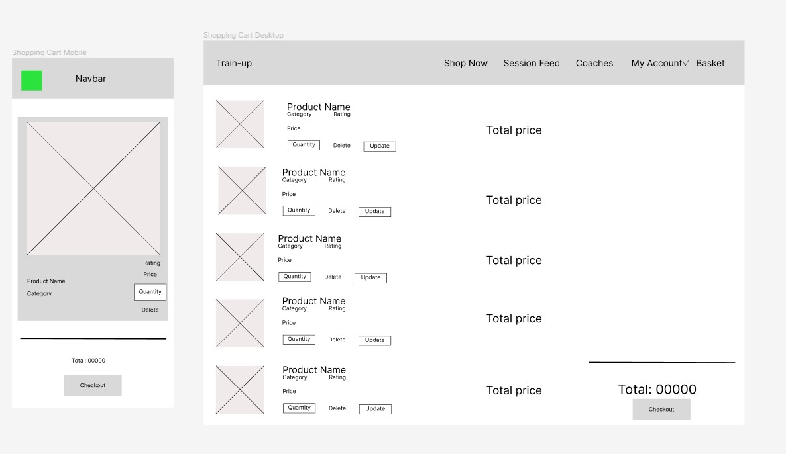
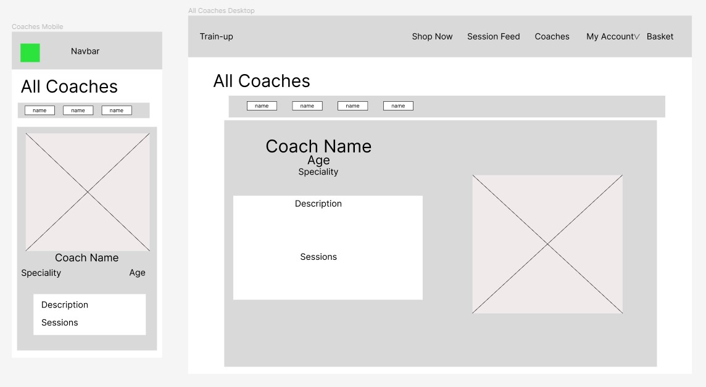
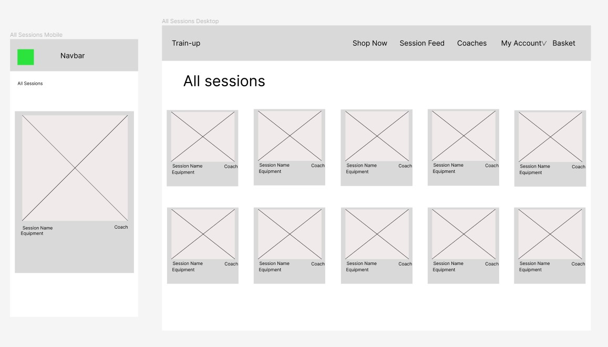
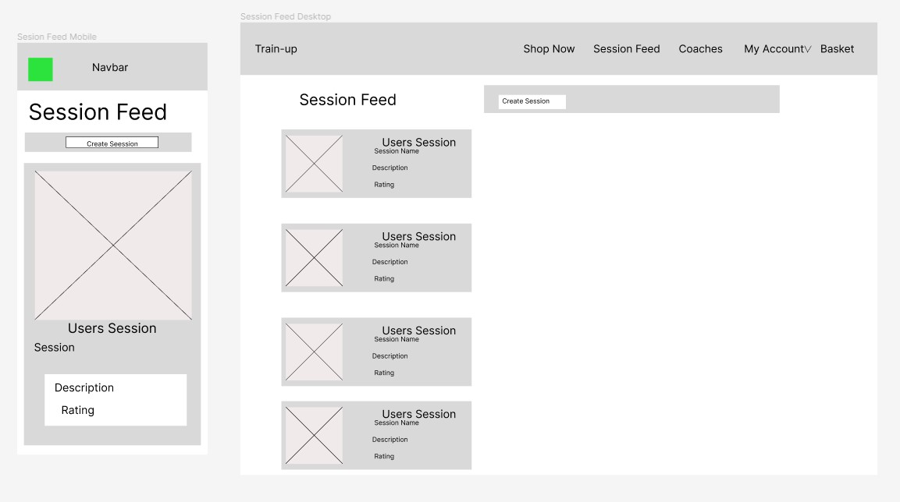
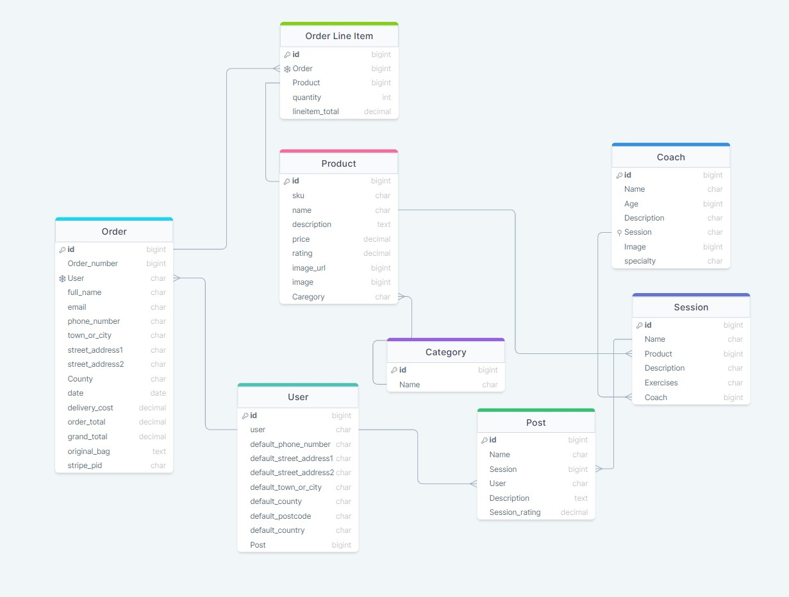
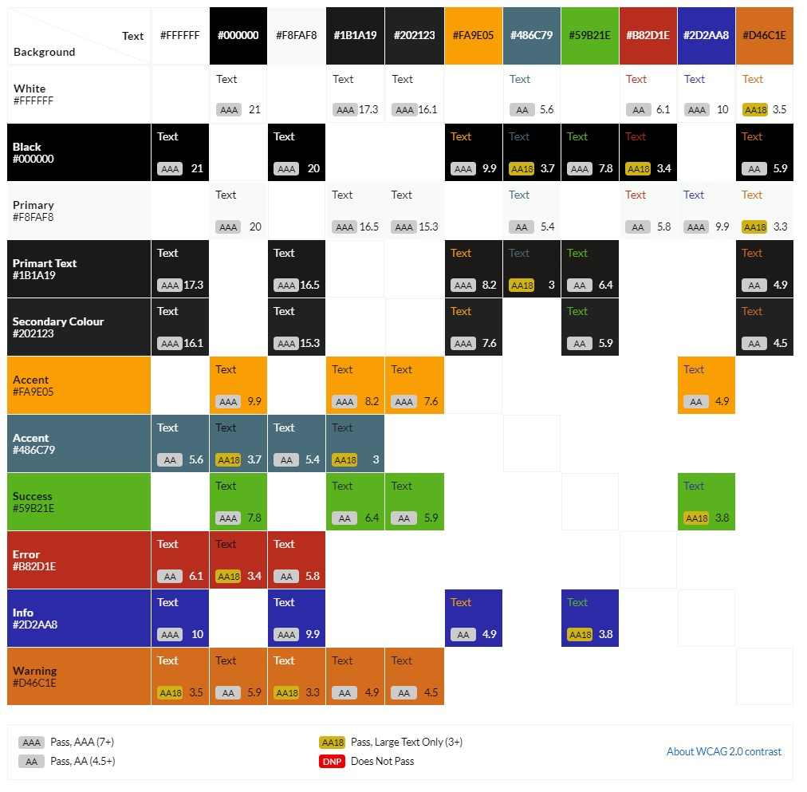

# Train-Up

## Introduction

Train-Up is a website developed using Django, HTML, CSS, Python and JavaScript. This business uses a business to consumer e-commerce model. The business sells sports equipment to customers and also provides users with session plans created by professional coaches using this equipment. 

Users of the site can search for products or filter them based on the category. They can select products and quantities and proceed to purchase in a user friendly process.  Users can also view the profiles of the professional coaches employed by the business to see what they specialize in. Once equipment has been purchased they will also have access to the sessions that the coach has created.

Registered users can save their address. View their purchased equipment and the training sessions associated with this equipment. They can also post their sessions and give feedback on their experience of the session.

The business owner can create, edit and delete equipment, that is for sale as well as the sessions and coaches. They can also delete user session posts if necessary. 

## Image of webmockup

[View the live website on Heroku](https://train-up-pp5-da4fce5b9326.herokuapp.com/)

Please note: To open any links in this document in a new browser tab, please press CTRL + Click.

## Table of Contents

## UX

### Overall Goals
- To provide an ecommerce solution for a business selling fitness products to consumers.
- To allow business owners to manage and modify existing products and to add new products, coaches and sessions.
- To provide users with a smooth and user friendly means to purchase products, and share their experience with the sessions.

### The Strategy Plane
- Train-Up is a business to consumer ecommerce website that allows users to select, purchase and share their experience with their purchases. The business owner is able to manage the products & content on offer on the site. The design of the sites main goal is to allow users a clear and easy to follow space to purchase products, and then to return to the site to get training sessions from the site and post about their experience. 

### The Sites Ideal User
- Interested in fitness.
- Interested in buying a product that allows them to elevate their fitness journey and provide better results.
- Interested in not only getting a product but then returning to get inspired on training plans, this means that even beginners would feel comfortable purchasing this equipment as they would be able to see how to use it.

### Site Goals
- To provide users with a place to purchase sports equipment.
- To provide users with a place to see how to use purchased equipment and give feedback on their sessions.
- To promote Train-Up as the preferred site for users to purchase sports equipment.

## User Stories

A total of 8 epics were created which were expanded into a total of 26 User Stories. The stories and epics were monitored using a kanban board you can find [Here](https://github.com/users/Janisroz/projects/3/views/1). Below is a basic layout of the epics and user stories:

1. Django Initial Setup
    - Create Django Project
    - Create first app
    - Install required packages

2. Viewing and Navigation
    - View a list of products
    - View individual Products
    - View a home page

3. Registration
    - Register a new account
    - Email confirmation
    - Login and logout of an account
    - Login using social media?

4. User Account
    - Edit user profile
    - View purchases
    - Post completed session
 
5. Sorting and Searching
    - Sort products 
    - Sort by category
    - Search by name
    - See what has been searched for

6. Purchasing and Checkout
    - Easily add items to basket
    - Edit basket
    - Easily checkout
    - View order history

7. Site Managemeny
    - Add edit and delete products 
    - Add edit and delete coaches
    - Add edit and delete Sessions

8. Coaches
    - View coach inforomation
    - View coaches sessions once logged in

## The Scope Plane

### Essential Content

- Landing page with call to action
- Allow users to view a list of products
- Allow users to view the details of a specific product
- Allow users to create an account
- Send a confirmation email on account sign-up
- Allow users to login
- Allow users to view thier previous orders
- Allow logged in users to post their completed sessions
- Allow users to sort products by name, price and category
- Allow users to search for products
- Allow users to add items to their basket
- Allow users to securily and easily checkout
- Allow site admin to Add edit and delete products
- Allow site admin to Add edit and delete coaches
- Allow site admin to Add edit and delete sesions
- Allow site admin to delete sesion posts
- Allow users to view coach information
- Allow users to view sessions once logged in
- Allow users to add their email to the mailing list

### Optional Content
- Breadcrumb features across site
- Login using social media
- React to other users posts
- Timer and session tracket to use during workout

## The Structure Plane

The site consists of a number of sections:

- Firstly the landing and about us pages are the welcome pages to the site. Calling the user to action with large buttons and the about us page explaining the purpose of the site
- The products page allows the user to search and filter products down to their specific requirements
- The product detail page allows users to get more info on the product and add it to their cart
- The bag page allows users to view and edit the products that they have selected
- The checkout form allows users to securely make payments and checkout
- The order confirmation page confirms the users order and informs them that a confirmation email will be sent
- The session feed allows logged in users to post their sessions and give their opinions on them
- The coaches page displays the coaches at Train-Up and if a user is logged in they can see the sessions that the coach created
- The sessions page is visible if a user logs in. There they have access to sessions for all the sites equipment
- Site admin are able to delete user sessions in case they are deemed inappropriate
- Site admin are also able to Create, Edit and delete coaches, sessions and products

## The Skeleton Plane

### Wireframes

Wireframes were used to develop a plan for the layout of the pages. Although this was often modified and tweaked during development the majority of pages had a wireframe developed for them. These wireframes were used as the reference point when developing the pages. All wireframes can be viewed below:

- Home Page

- All Products

- Individual Products

- Shopping Cart

- Coaches

- All Sessions

- Individual Sessions

- Sessions Feed

## Database Schema

During the planning phase of the site, DrawSQL was used to plan out the models that will be required throughout the development of the site. The authentication system of the site was chosen to be handled by AllAuth. This removed the need of a custom User Model as AllAuth uses the Django User Model. In the future it may be necessary to expand the model further but for the current needs of the site it was unnecesary to edit the User Model. 

For the product model, a custom model based on the boutique_ado model was created. Some fields were altered to fit the specific needs of the products.In future releases it may become necessary to allow for further fields to be added as more product options become available.

The order process is processed using the Order & Order Line Item models. Both these models were based on the Boutique Ado walkthrough being modified to fit the purpose of the site. The Boutique Ado models utilized the information needed by stripe to process payments so it made sense to base the sites models  off of these.

A Coach model was created so that site users were able to see who is using the products and based on the coach and their speciality what products may suit them. 

The session model was created to allow coaches to post their own sessions that are linked to products on the store. This allows users who are only starting their fitness journey to confidently purchase equipment as they will be able to refer back to the site to see how to use the specific equipment that they have purchased.

The Post model was created to allow users to post their workouts, rate them and give a brief description of their session. It links back to the session they posted about and also to the user that posted it.

## SEO Considerations 

To achieve best SEO results research was carried out to ensure that the target market of the site could be specifically targeted. This research utilized Google's SEO tools, which offer insights into frequently searched terms by users. It enables the exploration of these terms across specific target markets. The Uk and USA markets were used as examples.

[Home Workout Market Research](docs/README_images/home-workout-market-research.jpg)

[Personal Training Market Research](docs/README_images/personal-training-market-research.jpg)

[Training Plan Market Research](docs/README_images/training-plan-market-research.jpg)

Using this research a keyword list of short and long tail keywords was developed and implemented throughout the site. These were also included in the meta head description tags. However was only a small part of the SEO strategy for this site.

### Content Strategy

The main focus of the SEO strategy of this site involved users consistently returning to the site and sharing it with their friends. Users are not required to be fitness experts to benefit from this site as they are given session plans for their equipment meaning after purchase they will return to the site to use the session plans and post their completed sessions. The vision is that users will return to the site and share it with friends to keep themselves motivated by sharing their workouts and viewing their friends training.

## The Surface Plane

### Design

Once the structure and layout of the site was complete a color scheme was developed with the main goal being to focus the users on the content and to provide a clean, aesthetically pleasing design. The main colors chosen for the site was an off-white color for the backgrounds and also black. Orange was chosen as a complimentary color with others being added as necessary. The colors were chosen specifically to ensure a clear layout allowing users to focus on call to actions and to enhance the purchasing experience.

### Typography

Two fonts were used throughout the development of the project: Anton was used for all heading and Sarabun was used for all other texts. These fonts were chosen as they were clear and would stand out to the user, highlighting the important aspects of the site.

### Images

All images were acquired from the free image site [Pexels](https://www.pexels.com/).

