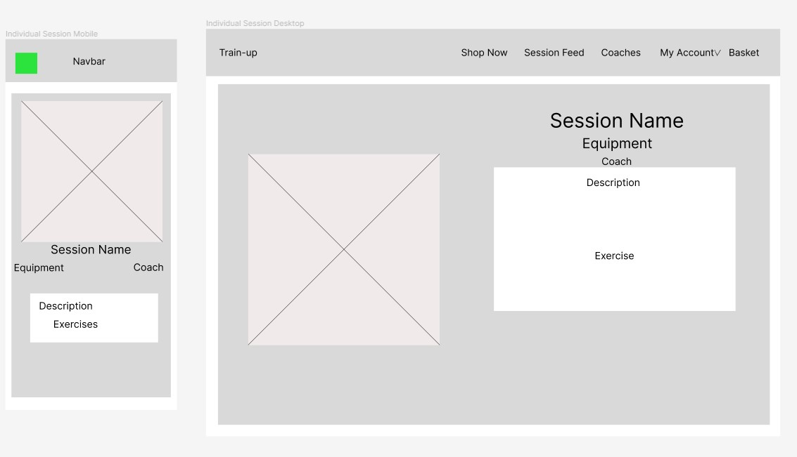
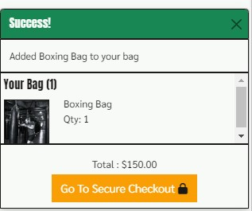
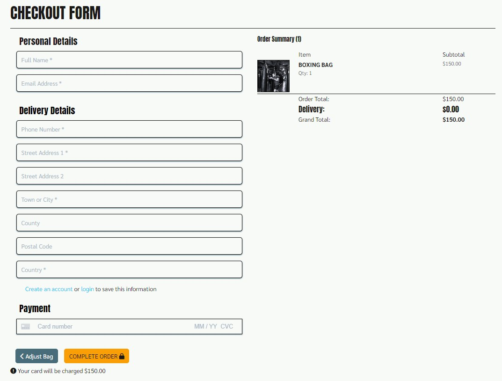
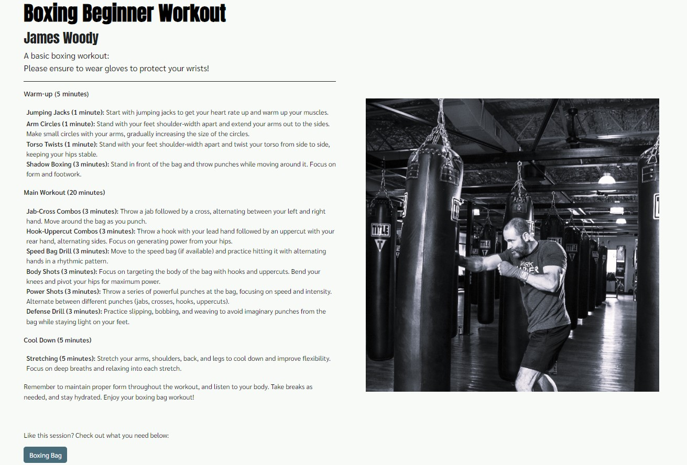

# Train-Up

## Introduction

Train-Up is a website developed using Django, HTML, CSS, Python and JavaScript. This business uses a business to consumer e-commerce model. The business sells sports equipment to customers and also provides users with session plans created by professional coaches using this equipment. 

Users of the site can search for products or filter them based on the category. They can select products and quantities and proceed to purchase in a user friendly process.  Users can also view the profiles of the professional coaches employed by the business to see what they specialize in. Once equipment has been purchased they will also have access to the sessions that the coach has created.

Registered users can save their address. View their purchased equipment and the training sessions associated with this equipment. They can also post their sessions and give feedback on their experience of the session.

The business owner can create, edit and delete equipment, that is for sale as well as the sessions and coaches. They can also delete user session posts if necessary. 

[View the live website on Heroku](https://train-up-pp5-da4fce5b9326.herokuapp.com/)

Please note: To open any links in this document in a new browser tab, please press CTRL + Click.

## Table of Contents

## UX

### Overall Goals
- To provide an ecommerce solution for a business selling fitness products to consumers.
- To allow business owners to manage and modify existing products and to add new products, coaches and sessions.
- To provide users with a smooth and user friendly means to purchase products, and share their experience with the sessions.

### The Strategy Plane
- Train-Up is a business to consumer ecommerce website that allows users to select, purchase and share their experience with their purchases. The business owner is able to manage the products & content on offer on the site. The design of the sites main goal is to allow users a clear and easy to follow space to purchase products, and then to return to the site to get training sessions from the site and post about their experience. 

### The Sites Ideal User
- Interested in fitness.
- Interested in buying a product that allows them to elevate their fitness journey and provide better results.
- Interested in not only getting a product but then returning to get inspired on training plans, this means that even beginners would feel comfortable purchasing this equipment as they would be able to see how to use it.

### Site Goals
- To provide users with a place to purchase sports equipment.
- To provide users with a place to see how to use purchased equipment and give feedback on their sessions.
- To promote Train-Up as the preferred site for users to purchase sports equipment.

## User Stories

A total of 8 epics were created which were expanded into a total of 26 User Stories. The stories and epics were monitored using a kanban board you can find [Here](https://github.com/users/Janisroz/projects/3/views/1). Below is a basic layout of the epics and user stories:

1. Django Initial Setup
    - Create Django Project
    - Create first app
    - Install required packages

2. Viewing and Navigation
    - View a list of products
    - View individual Products
    - View a home page

3. Registration
    - Register a new account
    - Email confirmation
    - Login and logout of an account
    - Login using social media?

4. User Account
    - Edit user profile
    - View purchases
    - Post completed session
 
5. Sorting and Searching
    - Sort products 
    - Sort by category
    - Search by name
    - See what has been searched for

6. Purchasing and Checkout
    - Easily add items to basket
    - Edit basket
    - Easily checkout
    - View order history

7. Site Managemeny
    - Add edit and delete products 
    - Add edit and delete coaches
    - Add edit and delete Sessions

8. Coaches
    - View coach inforomation
    - View coaches sessions once logged in

## The Scope Plane

### Essential Content

- Landing page with call to action
- Allow users to view a list of products
- Allow users to view the details of a specific product
- Allow users to create an account
- Send a confirmation email on account sign-up
- Allow users to login
- Allow users to view thier previous orders
- Allow logged in users to post their completed sessions
- Allow users to sort products by name, price and category
- Allow users to search for products
- Allow users to add items to their basket
- Allow users to securily and easily checkout
- Allow site admin to Add edit and delete products
- Allow site admin to Add edit and delete coaches
- Allow site admin to Add edit and delete sesions
- Allow site admin to delete sesion posts
- Allow users to view coach information
- Allow users to view sessions once logged in
- Allow users to add their email to the mailing list

### Optional Content
- Breadcrumb features across site
- Login using social media
- React to other users posts
- Timer and session tracket to use during workout

## The Structure Plane

The site consists of a number of sections:

- Firstly the landing and about us pages are the welcome pages to the site. Calling the user to action with large buttons and the about us page explaining the purpose of the site
- The products page allows the user to search and filter products down to their specific requirements
- The product detail page allows users to get more info on the product and add it to their cart
- The bag page allows users to view and edit the products that they have selected
- The checkout form allows users to securely make payments and checkout
- The order confirmation page confirms the users order and informs them that a confirmation email will be sent
- The session feed allows logged in users to post their sessions and give their opinions on them
- The coaches page displays the coaches at Train-Up and if a user is logged in they can see the sessions that the coach created
- The sessions page is visible if a user logs in. There they have access to sessions for all the sites equipment
- Site admin are able to delete user sessions in case they are deemed inappropriate
- Site admin are also able to Create, Edit and delete coaches, sessions and products

## The Skeleton Plane

### Wireframes

Wireframes were used to develop a plan for the layout of the pages. Although this was often modified and tweaked during development the majority of pages had a wireframe developed for them. These wireframes were used as the reference point when developing the pages. All wireframes can be viewed below:

- Home Page

- All Products

- Individual Products

- Shopping Cart

- Coaches

- All Sessions

- Individual Sessions

- Sessions Feed

## Database Schema

During the planning phase of the site, DrawSQL was used to plan out the models that will be required throughout the development of the site. The authentication system of the site was chosen to be handled by AllAuth. This removed the need of a custom User Model as AllAuth uses the Django User Model. In the future it may be necessary to expand the model further but for the current needs of the site it was unnecesary to edit the User Model. 

For the product model, a custom model based on the boutique_ado model was created. Some fields were altered to fit the specific needs of the products.In future releases it may become necessary to allow for further fields to be added as more product options become available.

The order process is processed using the Order & Order Line Item models. Both these models were based on the Boutique Ado walkthrough being modified to fit the purpose of the site. The Boutique Ado models utilized the information needed by stripe to process payments so it made sense to base the sites models  off of these.

A Coach model was created so that site users were able to see who is using the products and based on the coach and their speciality what products may suit them. 

The session model was created to allow coaches to post their own sessions that are linked to products on the store. This allows users who are only starting their fitness journey to confidently purchase equipment as they will be able to refer back to the site to see how to use the specific equipment that they have purchased.

The Post model was created to allow users to post their workouts, rate them and give a brief description of their session. It links back to the session they posted about and also to the user that posted it.

## SEO Considerations 

To achieve best SEO results research was carried out to ensure that the target market of the site could be specifically targeted. This research utilized Google's SEO tools, which offer insights into frequently searched terms by users. It enables the exploration of these terms across specific target markets. The Uk and USA markets were used as examples.

[Home Workout Market Research](docs/README_images/home-workout-market-research.jpg)

[Personal Training Market Research](docs/README_images/personal-training-market-research.jpg)

[Training Plan Market Research](docs/README_images/training-plan-market-research.jpg)

Using this research a keyword list of short and long tail keywords was developed and implemented throughout the site. These were also included in the meta head description tags. However was only a small part of the SEO strategy for this site.

### Content Strategy

The main focus of the SEO strategy of this site involved users consistently returning to the site and sharing it with their friends. Users are not required to be fitness experts to benefit from this site as they are given session plans for their equipment meaning after purchase they will return to the site to use the session plans and post their completed sessions. The vision is that users will return to the site and share it with friends to keep themselves motivated by sharing their workouts and viewing their friends training.

## The Surface Plane

### Design

Once the structure and layout of the site was complete a color scheme was developed with the main goal being to focus the users on the content and to provide a clean, aesthetically pleasing design. The main colors chosen for the site was an off-white color for the backgrounds and also black. Orange was chosen as a complimentary color with others being added as necessary. The colors were chosen specifically to ensure a clear layout allowing users to focus on call to actions and to enhance the purchasing experience.

### Typography

Two fonts were used throughout the development of the project: Anton was used for all heading and Sarabun was used for all other texts. These fonts were chosen as they were clear and would stand out to the user, highlighting the important aspects of the site.

### Images

All images were acquired from the free image site [Pexels](https://www.pexels.com/). The logo of the site was created using [Canva](https://www.canva.com/).

## Features

### Navigation

The main navigation consists of the logo on the left side which links back to the home page and a number of links on the right side. Account management is available from the nav bar and an extra link to sessions is added when a user is logged in. Using Bootstrap navigation tools the nav compresses to a hamburger menu when on smaller devices. When an admin is logged in the nav also provides a link to the add new products page.

### Footer 

A basic footer was created with a link to the sites Facebook Page and also a signup form to the sites newsletter. The choice to insert the newsletter signup to the footer was deliberate ensuring that users have a chance to sign up at any time.

### Home Page

The home welcomes users to the site and immediately calls them to action with a large button urging them to check out our products. There is also a smaller learn more button linking the user to the information page if users want to learn more about the site.

### All Products

The all products page features a search bar and some filtering options to allow the user to find exactly what they are looking for. 

### Individual Products

Each product has its own page that allows users to select a quantity of an item and add that item to their bag it also provides the price rating and description of the product

### Adding To Bag

When a product is added to the users bag a message is displayed informing the user that an item has been added to their bag and also provides a link to the bag allowing them to proceed to checkout

### Shopping Bag

The Shopping bag page allows users to review what they have added to their cart adjust quantities or remove items altogether. It clearly shows the total amount to pay and also currently highlights the free delivery as at the moment the site will run a free delivery promotion that can be seen on the home page of the site. If the user chooses to continue shopping or to proceed to checkout both options are available as buttons at the bottom of the page.

### Checkout Page

When a user decides it is time to complete the purchase they are directed to the checkout page. This page contains a order summary of what the user has selected and a checkout form. If a user is logged in and has oreviously saved their delivery details these will be pre-populated. Below that is a stripe element requiring card details. As it is currently only using testing functionality only the test card information can only be used.

### Order Confirmation 

When an order is complete a number of things happen. A message is displayed confirming to the user that the order was succesful and that an email has been sent to the provided email. The user is also redirected to the order success page where there is a breakdown of their order details and a link to continue shopping. Finally the user recieves an email to the provided email confirming their purchase.

### Coaches Page

The coaches page provides users with a profile for each coach and admin have the ability to add, edit and delete coaches all from this page. If a user is logged in they are also provided with links to the sessions that the coach is linked to.

### Sessionn Feed

The session feed is a location for users of the site to post their experiences with the equipment. Users can give ratings on the sessions and give a description of how the session went. This feature urges users to return to the site to use the sessions that come with their equipment and also post about their experience with it. Admin users can also delete posts from this page if they deem them inapropriate.

### All Session Page

The all sessions page provides logged in users to access to all the workout sesions on the site. This page displays all the sessions allowing logged in users to check out any session and possibly purchase required equipment if they like the workouts. Admin users can also add posts from this page. Each card has a short workout description and a link to the coach and the equipment required.

### Session Detail Page

Each session has its own page that details the workout that is associated with it. Admin staff can edit or delete the session here. It also provides a link to the equipment required in case the user chooses that they would like to use our equipment and do this workout.

## Future Enhancements

In the future there are a number of enhancements that would be nice to add. The main areas that enhancements could be added to include:

- More sessions- this would be a benefit as users would be more interested in purchasing a product with more workout options available to them especially beginners. Workouts with more than one piece of equipment for sale could also motivate users to purchase more equipment

- Exclusive sessions that are only available when you have purchased the equipment would motivate users to make purchases.

- Reacting and commenting on the session feed would be a positive addition to allow users further interaction with each other

- Social media login using Gmail, Facebook, Instagram etc.

## Social Media Marketing

As part of the assessment , a Facebook page was established for the company. Social media plays a pivotal role in the marketing strategy of any ecommerce website, and the page was designed to be an integral part of the business's marketing approach. It featured links directing users from the social platform to the main website, aiming to boost traffic and engagement. The content on the page urged users to visit the site. 

## Testing

All testing can be viewed in the [TESTING.md](TESTING.md)

## Technologies Used

- Python 
    - The following python modules were used in the project: 
        - asgiref==3.7.2
        - boto3==1.34.61
        - botocore==1.34.61
        - cloudinary==1.38.0
        - dj-database-url==0.5.0
        - dj3-cloudinary-storage==0.0.6
        - Django==3.2.24
        - django-allauth==0.41.0
        - django-countries==7.2.1
        - django-crispy-forms==1.14.0
        - django-storages==1.14.2
        - django-summernote==0.8.20.0
        - gunicorn==21.2.0
        - jmespath==1.0.1
        - oauthlib==3.2.2
        - pillow==10.2.0
        - psycopg2==2.9.9
        - python3-openid==3.2.0
        - pytz==2024.1
        - requests-oauthlib==1.3.1
        - s3transfer==0.10.0
        - sqlparse==0.4.4
        - stripe==8.5.0
        - urllib3==1.26.15

- Django
    - Django was used as the main framework throughout development of this site. Many of its included packages were used such as AllAuth that provided account management functionality.

- Heroku
    - Heroku was the platform that the live site was deployed on.

- ElephantSQL
    - Was used to manages PostgreSQL databases throughout development and deployment

- JavaScript
    - Custom Javascript was used throughout the site for a number of functions such as controlling buttons, enabling and disabling forms and buttons aswell as displaying messages and controlling collapsable elements.

- Bootstrap
    - Bootstrap 5.3 was used extensively to format the layout of the site as well as providing different elements used throughout the site.

- Font Awesome
    - Multiple icons were used from font awesome across the site

- Google Fonts
    - The custom fonts used by the site were imported from Google Fonts

- CSS
    - Custom CSS was used throughout the site to style elements for an original style.

- HTML 
    - HTML was used as the base language for the templates created for the site.

### Packages 

- Gitpod was used to develop the site

- Git was used to create the repository and for version control throughout development

- Github was used for storing the repository

- Figma was used to develop the wireframes 

- Canva was used to develop the logo

- DrawSQL was used to develop the model plans

### Resources Used

- Django Documentation was used extensively throughout deveolopent

- Bootstrap Documentation was used extensively to style layouts

- Django Summernote docs were used to implement the Summernote element in the forms

## Deployment

The site was deployed on Heroku the live link can be found here - [View the live website on Heroku](https://train-up-pp5-da4fce5b9326.herokuapp.com/)

- Heroku Deployment Steps:

    - Sign up or log in to Heroku.
    - Create a new app from the Heroku Dashboard.    
    - Give the app a unique name and select a suitable region.
    - Navigate to the settings tab.
    - Add the elephent SQL DATABASE_URL to the config vars.
    - Copy the DATABASE_URL from config vars for Django configuration.
    - Create an env.py file in the Django app repository and set environment variables for DATABASE_URL and SECRET_KEY.
    - Add the secret key and other environment variables to Heroku Config Vars.
    - Update settings.py with necessary imports and configurations, including database settings.
    - Migrate the models to the new database connection.
    - Create an S3 bucket on Amazon AWS for static and media files.
    - Copy bucket details into the settings file and env.py.
    - Set AWS access keys and secret access keys in env.py and Heroku Config Vars.
    - Add the DISABLE_COLLECTSTATIC key with value 1 to Heroku Config Vars.
    - Install required packages from requirements.txt.
    - Configure static files settings in settings.py.
    - Link the templates directory in Heroku.
    - Add Heroku to the ALLOWED_HOSTS list.
    - Create media, static, and templates folders.
    - Create a Procfile with the command to run the app.
    - Add, commit, and push changes to GitHub.
    - Deploy the branch manually in Heroku and monitor build logs for errors.
    - Upon successful deployment, access the live site through the provided link.

- Stripe Integration:

    - Create a Stripe account and obtain developer API keys.
    - Insert the keys into env.py and Heroku Config Vars.
    - Configure settings file to point to the required variables.
    - Follow Stripe's documentation for integrating Stripe within Django.

### Forking the GitHub Repository

- Sign in to GitHub or create an account if you don't have one.
- Find the repository at [https://github.com/Janisroz/PP5](https://github.com/Janisroz/PP5)
- On the top-right side of the repository page, click on the "Fork" button.
- This action will create a duplicate copy of the repository in your GitHub account.

### Cloning a GitHub Repository:
- Go to [https://github.com/Janisroz/PP5](https://github.com/Janisroz/PP5)
- Click on the arrow next to the green "Code" button.
- Select the "Clone by HTTPS" option and copy the provided URL.
- Open your preferred code editor and navigate to the terminal.
- Change the directory to the location where you want to clone the repository.
- Type 'git clone' followed by the copied HTTPS link from GitHub.
- Press Enter, and Git will clone the repository to your local machine.

## Aclnowledgements
A massive thanks to my mentor Daisy McGirr for the constant support throughout the whole course and especially in this project. Also a thanks to the CI Tutor support team who were able to help with issues I had throughout the course